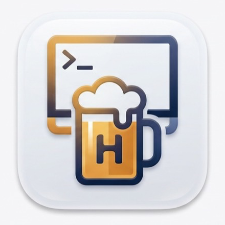
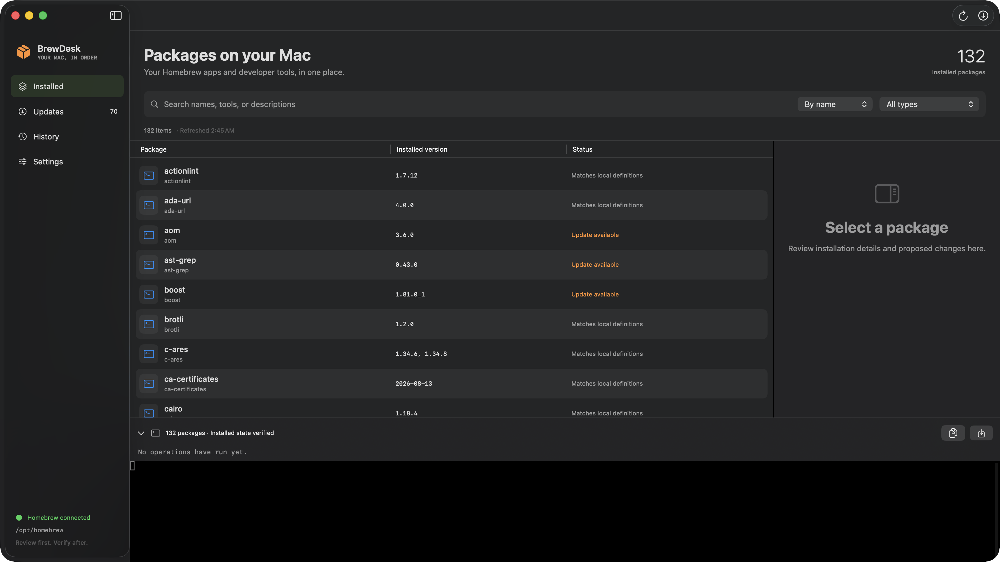
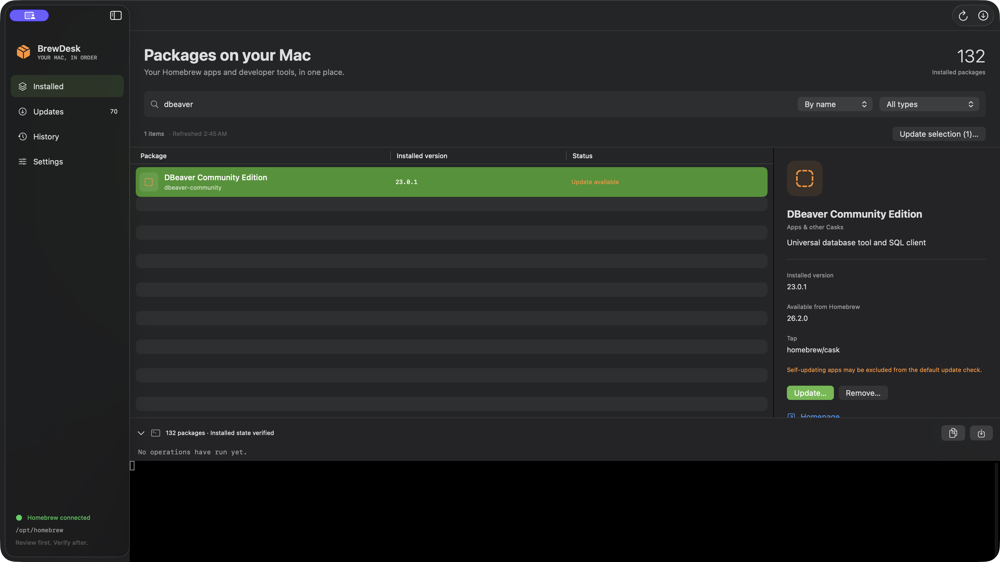
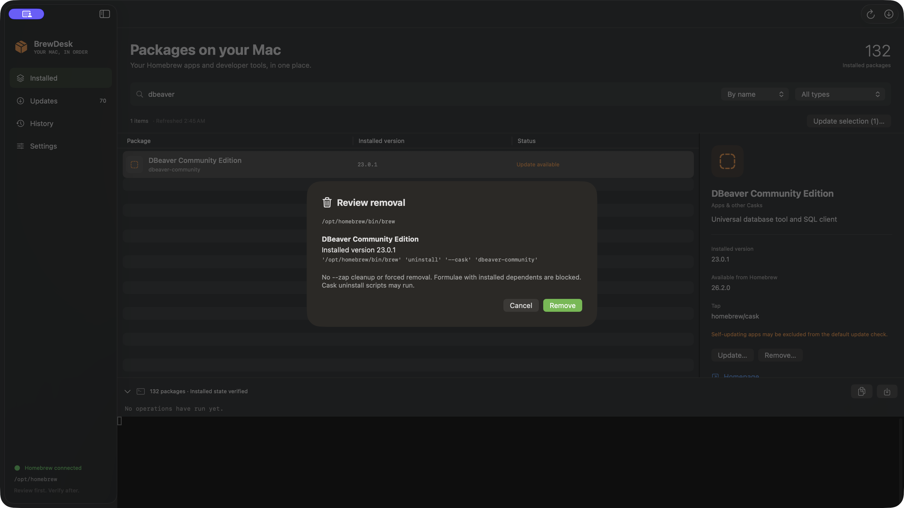
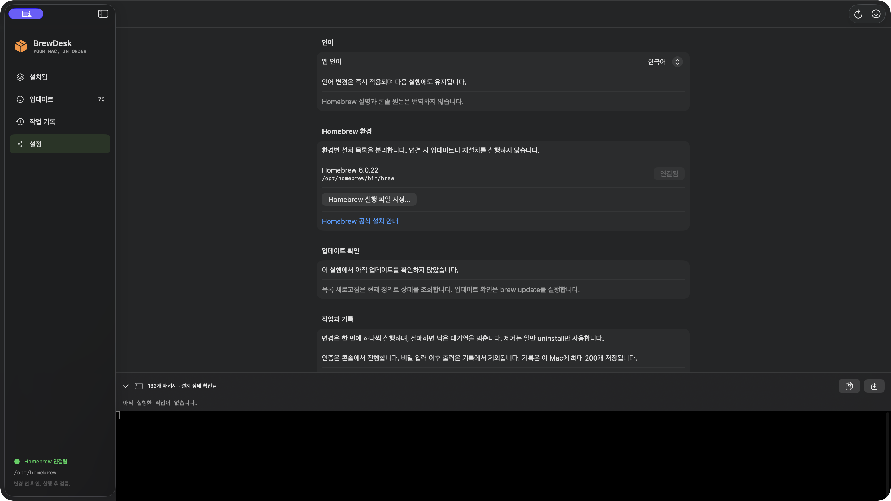

# BrewDesk



Your Homebrew apps and developer tools, in one native macOS app.

**English** · [한국어](README.ko.md)

[Download v0.3.2 for Apple Silicon](https://github.com/controlguy-ys/BrewDesk/releases/tag/v0.3.2) · [Watch the 60-second walkthrough](docs/media/brewdesk-walkthrough.mp4)



## Download and run

1. Install [Homebrew](https://brew.sh) if it is not already available.
2. Download `BrewDesk-0.3.2-macos-arm64.dmg` from the [release page](https://github.com/controlguy-ys/BrewDesk/releases/tag/v0.3.2).
3. Open the DMG, drag **BrewDesk** into **Applications**, and launch it.
4. BrewDesk detects the Homebrew environment. If more than one is available, choose one in **Settings**.

Requires **macOS 14 or newer**. The downloadable build is for **Apple Silicon**. Intel builds can be compiled on an Intel Mac but have not been validated here.

**Preview build:** the app is ad-hoc signed, with no Developer ID signature or Apple notarization. macOS may block a downloaded copy. If you trust this release and choose to run it, use the app-specific **Open Anyway** option in **System Settings → Privacy & Security** after attempting to open it. See [Apple’s guidance](https://support.apple.com/en-us/102445). Do not disable Gatekeeper globally. Validation so far covers the development Mac; installation on a separate Mac remains untested.

Download both the DMG and `SHA256SUMS.txt` into the same directory. Open Terminal in that directory and check the downloaded DMG:

```sh
shasum -a 256 -c SHA256SUMS.txt
```

## What you can do

BrewDesk manages installed packages and searches Homebrew for new Formulae and Casks.

- Browse installed Formulae and Casks with search, sorting, and type filters.
- Inspect installed and available versions, dependencies, and verified installation paths.
- Review the exact command and targets before an update or removal.
- Update multiple selected packages sequentially. A failure stops the remaining queue.
- Authenticate in the embedded terminal and inspect operation results and version changes.
- Switch between **English**, **한국어**, and **System language**. English is the default.

### A typical workflow

Select a package to inspect its details. Use **Check for updates** to review and run `brew update`, followed by an outdated-package query. **Refresh list** only reads the currently available definitions.

Some Cask installers or uninstallers may request administrator authentication. These prompts come from the underlying Homebrew or installer operation; respond in the embedded terminal. BrewDesk does not provide a separate password form.

Use the checkbox to the left of each package to select it. Above the list, **Select all** adds all visible packages, **Deselect all** clears the entire selection, and the selection count includes selected packages hidden by filters. **⌘A** selects all visible rows when the table has focus; in the search field it selects the search text. Command-click and checkboxes share the same selection. **Update all (N)…** reviews every eligible installed update regardless of search or filters, excluding pinned packages. **Update selection** includes only selected packages with available updates, excluding pinned packages. One confirmation approves the reviewed batch. Changes run one at a time. After an operation, BrewDesk queries Homebrew again and records observed version changes, including dependencies.

Formula removal is blocked when installed dependents are found. Cask removal uses ordinary `brew uninstall --cask`; Homebrew’s uninstall scripts may run. There is no forced removal or `--zap` cleanup. Stopping an operation sends Ctrl-C; it does not roll back changes. The app prevents quitting while an operation is active.

## See it in action

[](docs/media/brewdesk-walkthrough.mp4)

**[Watch or download the MP4](https://github.com/controlguy-ys/BrewDesk/releases/download/v0.2.0/brewdesk-walkthrough.mp4)** — a silent, continuous 60-second recording at 1920 × 1080. App interactions were performed through Computer Use and captured by macOS. It shows package details, a removal confirmation followed by cancellation, and live English/Korean switching. No package was updated or removed for the demonstration.

| Review a removal | Use Korean |
| --- | --- |
|  |  |

[All screenshots and capture notes](docs/media/README.md)

## Install packages

Open **Install packages**, leave **All types** selected to search Formulae and Casks together (or narrow the type), enter a package name, and press Search or Return. Select a result to load its description, version, dependencies, and homepage. **Install…** opens a confirmation with the exact command. Installed packages cannot be installed again from this screen. After installation, BrewDesk verifies the installed package and records its changes. Search displays up to 200 matches; narrow the query when needed. Package metadata stays in Homebrew’s original language.

The top-right toolbar has **Check for updates** on the left and **Update** on the right. The left button reviews and runs `brew update`; the right reviews all available unpinned package upgrades. Refresh installed state with **⌘R** or the View menu.

## History and terminal confirmations

Click anywhere on a history summary row, including its result, date, or blank space, to expand or collapse it. Log text selection and copy/save buttons remain independent.

Explicit terminal questions ending in `[y/n]` or `(yes/no)` are shown in a **Yes / No** popup while the process is waiting in normal line-input mode. The answer is sent to the running process; **Respond in terminal** leaves it unanswered for manual input. Password prompts, raw-input prompts, and unrecognized questions remain in the terminal. Detection resumes when normal echoed line input returns after authentication; secret-input log suppression remains in force. No response is sent automatically.

## Language support

Open **Settings → Language → App language**. Changes apply immediately and persist across launches. **System language** selects the first supported English or Korean language in macOS preferences, falling back to English. Relaunch BrewDesk after changing macOS language preferences.

App-owned screens, confirmation dialogs, errors, and new history result summaries are localized. Package names, Homebrew descriptions, raw terminal output, and legacy history snapshots retain their original text.

Translations live in [`en.json`](Sources/BrewDesk/Resources/en.json) and [`ko.json`](Sources/BrewDesk/Resources/ko.json). Placeholders such as `{0}` preserve dynamic values. Missing translations fall back to English, then to the original key. To add a language, register it in [`Localization.swift`](Sources/BrewDesk/Localization.swift), add its catalog and system-language resolution, and update `CFBundleLocalizations` in the build script. Catalog tests check matching keys and placeholders.

## Build and test

Building requires a Swift 6 toolchain and an internet connection for the initial pinned SwiftTerm dependency download. Tested with Swift 6.3 from Command Line Tools and Xcode 26.6. Command Line Tools suffice for building; tests require full Xcode with XCTest. `scripts/test.sh` selects `/Applications/Xcode.app/Contents/Developer` when available; set `DEVELOPER_DIR` to your Xcode developer directory if installed elsewhere. The scripts build for the host Mac’s CPU architecture.

```sh
git clone https://github.com/controlguy-ys/BrewDesk.git
cd BrewDesk
./scripts/test.sh
./scripts/build-app.sh
open dist/BrewDesk.app
```

Create a DMG with `./scripts/package-dmg.sh`. Output is `dist/BrewDesk-local.dmg`. During development, `swift run BrewDesk` also works. For everyday use, copy the app from the DMG to Applications; File Provider folders can add metadata that affects signature verification.

The XCTest suite covers command validation, JSON parsing, version changes, history permissions, large stderr output, PTY exits and interruption, secret-input handling, operation sequencing, and localization. The default run skips one optional local fixture test. These tests do not update or remove real Homebrew packages. Real administrator-authenticated Cask changes remain outside the completed validation.

| Source | Responsibility |
| --- | --- |
| `Domain.swift` | Package models, command allowlist, version differences |
| `BrewRepository.swift` | Homebrew discovery, read processes, local history |
| `PTYRunner.swift` | SwiftTerm terminal and child-process lifecycle |
| `AppModel.swift` | UI state, sequential operations, verification |
| `BrewDeskApp.swift` | Native views, settings, and quit protection |
| `Localization.swift` | Language preferences, catalogs, dynamic messages |

## Local data and limits

History stores the latest 200 command records in `~/Library/Application Support/BrewDesk/history.json`, with directory permissions `0700` and file permissions `0600`. Terminal input is not saved. Output is omitted while terminal echo is disabled and for the remainder of an operation after secret input is sent. Saved logs may therefore be incomplete. Terminal output and manually exported logs can contain local paths and installer messages.

BrewDesk does not manage services, run Homebrew as root, or roll back changes. Self-updating and `latest` Casks have update-check limitations. Observed changes cannot always distinguish BrewDesk operations from concurrent external modifications.

Built with SwiftUI and [SwiftTerm](https://github.com/migueldeicaza/SwiftTerm). See [third-party notices](THIRD_PARTY_NOTICES.md). Homebrew command behavior is documented in the [Homebrew manual](https://docs.brew.sh/Manpage) and [JSON query documentation](https://docs.brew.sh/Querying-Brew).
